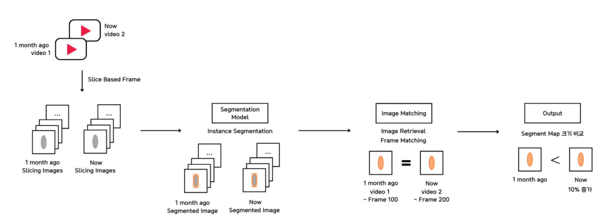

# 이어드림 스쿨 3기 스타트업 연계 프로젝트
### DS 3팀 - 시간의 흐름에 따른 노후 인프라시설 건축물의 외관과 내부 Crack 감지 (소테리아에이트)
- Project Peroid : 23.11.08~23.12.15
- Team : 맘에들었조
- Member : 양태경, 김다현, 임승준, 이지윤, 이종은, 박정재

## Topic
- instance segmentation, image retrieval


## Modeling Framework
- detectron2, ultralytics


## Requirements
you need to install our requirment packages
```python
$ pip install -r requirements.txt
```

## 소개
***
### 1. 문제 정의<br>
- 안전진단은 초음파등의 장비를 이용한 건물의 전역적 탐색이 필요 
- 로보틱스 촬영 기반 컴퓨터비전 안전진단 솔루션으로 예산과 인력부족의 문제를 해결할 수 있다.

### 2. 문제 접근 방법
- (1) 사람이탐색하기어려운구조물에대한데이터확보
- (2) 1차위험이 있는 이상징후 포착
- (3) 일정시간 이후 이상징후의 진전 여부 탐지



> 1.이전 촬영 영상과 일정 시간이 지난 뒤의 촬영 영상(비교군)을 input으로 설정합니다.<br>
> 2.각 영상을 frame단위로 slicing하여 segmentation model의 입력값으로 넣습니다.<br>
> 3.탐지된 이상징후(철근노출,bleeding)현상의 frame을 matching합니다 (ImageRetrieval)<br>
> 4.매칭된 이상징후의 면적 비교를 통해 이상징후의 진전 여부를 판단합니다.


### 3. 훈련 데이터 명세

### 4. 모델 


yolo-v8 best.pt<a href ='https://miaow-miaow.tistory.com/83'></a>
훈련된 모델의 가중치를 사용하기 위해 다운로드가 필요합니다.

### 5. 벤치마크 정보

### 6. Image Retireval

### 7. 최종 결과물


***

### Introduction
***
1. Problem Definition<br>
- Safety diagnosis requires global exploration of buildings using equipment such as ultrasonic waves 
- 로보틱스 촬영 기반 컴퓨터비전 안전진단 솔루션으로 예산과 인력부족의 문제를 해결할 수 있다.

2. 문제 접근 방법
- (1) 사람이탐색하기어려운구조물에대한데이터확보
- (2) 1차위험이 있는 이상징후 포착
- (3) 일정시간 이후 이상징후의 진전 여부 탐지


3. 훈련 데이터 명세

4. 모델 


yolo-v8(best.pt)
훈련된 모델의 가중치를 사용하기 위해 다운로드가 필요합니다.

5. 벤치마크 정보

6. Image Retireval

7. 최종 결과물


<!--T
### Stacks

|Category|Description|
|:--:|:--:|
|**Languag**e|
|**Storage**||
|**Deeplearning**||
|**ImageProcessing**||
|**Environment**||
|**Communication**||
-->


***
### Directory
<!--Table-->
|Category|Description|
|:--:|:--:|
|yolo|cell2|
|frame_matching|cell2|
|demo.py|Cell2|
|results.txt|Cell2|


***
### Acknowledgement
We refer to the following website to implement our models ("site")
